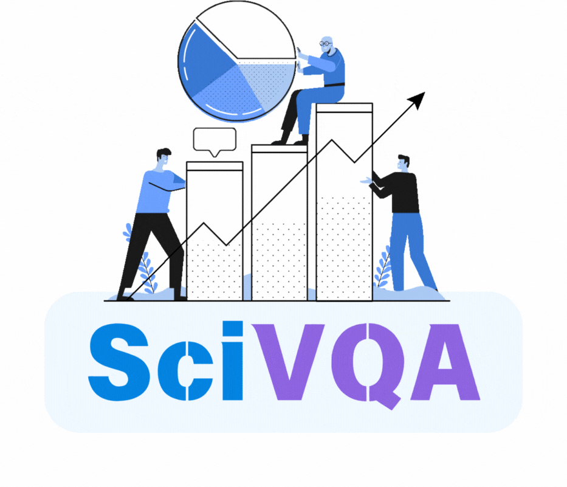

   
  <strong>Scientific Visual Question Answering shared task</strong>

# Data

The SciVQA is a corpus of chart images extracted from scientific publications in Computational Linguistics available in arXiv and ACL Anthology. SciVQA is a subset of the two existing datasets:
* [ACL-Fig](https://huggingface.co/datasets/citeseerx/ACL-fig) (Zeba Karishma et. al, 2023)
* [SciGraphQA](https://huggingface.co/datasets/alexshengzhili/SciGraphQA-295K-train?row=0) (Shengzhi Li and Nima Tajbakhsh, 2023)
The SciVQA comprises 11678 images in .png format and can be dowloaded from Zenodo: 

## Dataset statistics

| Source data | N of unique papers | Total N of chart images | Total N of QA pairs | 
|-------------|--------------------|-------------------------|---------------------|
|  ACL-Fig    |   530              |   948                   |                     | 
|  SciGraphQA |   1750             |   2052                 |                     | 
|  **Total**  |   **2280**         |   **3000**             |                     | 

| Question types | N in ACL papers | N in arXiv papers| 
|----------------|-----------------|------------------|
|                |                 |                  |             

Details on the papers distribution per year and venue are availabel under [utils](https://github.com/esborisova/SciVQA/blob/main/src/utils/papers_dist.png).
**Note:** Currently all images and metadata files are stored on Pegasus and HF under private repository.

# Contributors

Ekaterina Borisova (DFKI)

Raia Abu Ahmad (DFKI)
