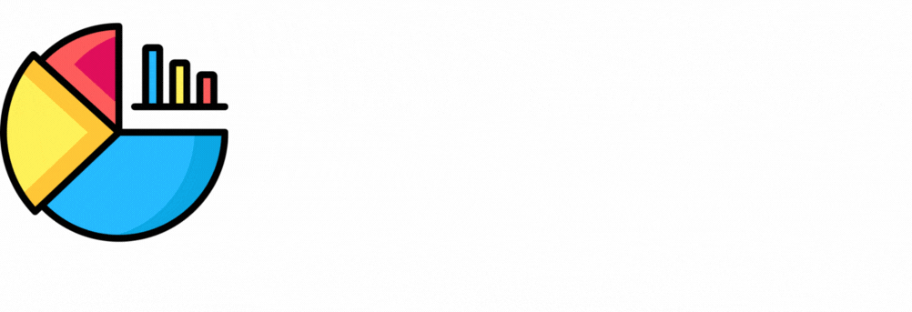
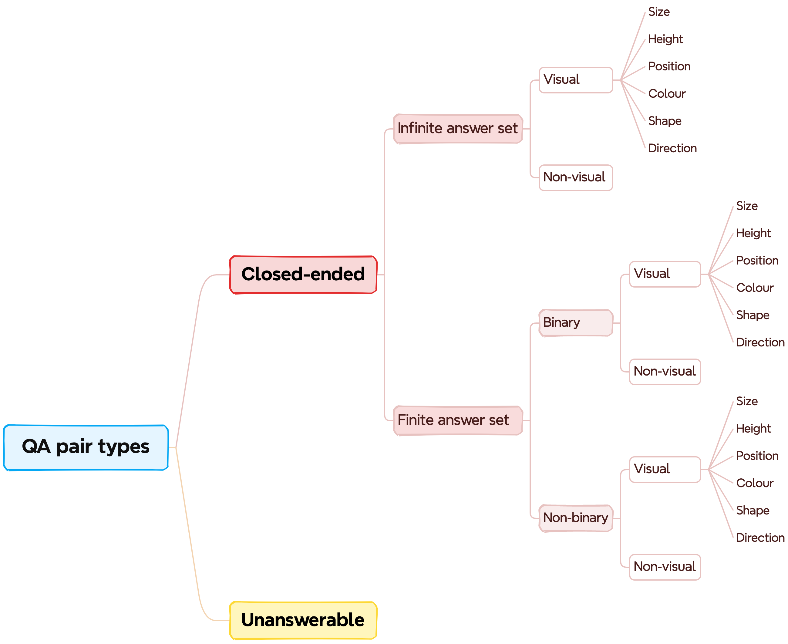

# 
**Scientific Visual Question Answering (SciVQA)** shared task was orginised as part of the [Scholarly Document Processing workshop (SDP)](https://sdproc.org/2025/) at ALC 2025. In this challenge, participants developed multimodal QA systems using images of scientific figures, their captions, associated natural language QA pairs, and optionally additional metadata. The competition was hosted on the [Codabench platform](https://www.codabench.org/competitions/5904/). 

This repository stores the code used for constructing the SciVQA dataset and developing the competition baseline. 

# Data

The SciVQA dataset comprises **3000** images of real-world figures extracted from English scientific publications in Computational Linguistics available in arXiv and ACL Anthology. The images are collected from the two pre-existing datasets: 
- __ACL-Fig  <a href='https://arxiv.org/abs/2301.12293'></a> <a href='https://huggingface.co/datasets/citeseerx/ACL-fig'></a>__

- __SciGraphQA  <a href='https://arxiv.org/abs/2308.03349'></a> <a href='https://huggingface.co/datasets/alexshengzhili/SciGraphQA-295K-train?row=0'></a>__

Each figure is availabe as PNG and associated with 7 QA pairs according to the custom schema (see below). All figures are automatically annotated using the Gemini 1.5-flash model and then manually validated by graduate students with Computational Linguistics background. SciVQA contains **21000** QA pairs in total. The language of all QA pairs is English. 

**The dataset is publicly available on [Hugging Face](https://huggingface.co/datasets/katebor/SciVQA).** 

# QA pair types schema



- **Closed-ended** - it is possible to answer a question based only on a given data source, i.e., an image or an image and a caption. No additional resources such as the main text of a publication, other documents/figures/tables, etc. are required.
- **Unanswerable** - it is not possible to infer an answer based solely on a given data source.
- **Infinite answer set** - there are no predefined answer options., e.g., "What is the sum of Y and Z?".
- **Finite answer set** - associated with a limited range of answer options. Such QA pairs fall into two subcategories:
  - **Binary** - require a yes/no or true/false answer, e.g., "Is the percentage of positive tweets equal to 15%?".
  - **Non-binary** - require to choose from a set of **four** predefined answer options where one or more are correct, e.g., "What is the maximum value of the green bar at the threshold equal to 10?" Answer options: "A: 5, B: 10, C: 300, D: None of the above".
- **Visual** - address or incorporate information on one or more of the **six visual attributes** of a figure, i.e., *shape*, *size*, *position*, *height*, *direction* or *colour*. E.g., "In the bottom left figure, what is the value of the blue line at an AL of 6?". Here the visual aspects are: position (bottom left), colour (blue), and shape (line).
- **Non-visual** - do not involve any of the six visual aspects of a figure defined in our schema, e.g., "What is the minimum value of X?".

# Repository structure
```
    ├── data               # qa prompts, annotation guidelines, csv files with human answers and predictions from the baseline
    ├── src               
    │   ├── data_pred      # data preparation scripts
    │   ├── baseline       # 
    │   ├── eval           # scoring script      
    └──         
```


# Cite
TBA
